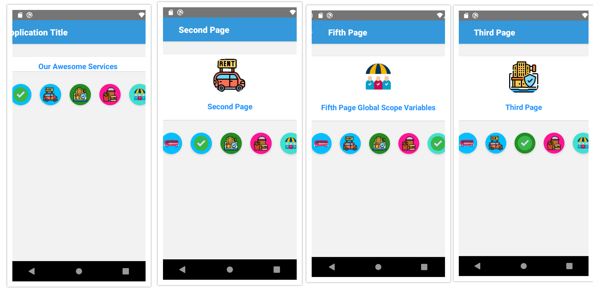

# React Native Global Scope Variables | Initialize once use Everywhere

If we have myvar which is a local variable and accessible only from the same class. and if we have global.myvar then it becomes global and can be accessed from any class of the application.

Here is an example to understand it. We have a global.MyVar variable initialized in the first screen which can be accessed from First Screen as well as from the Second Screen.

## License
